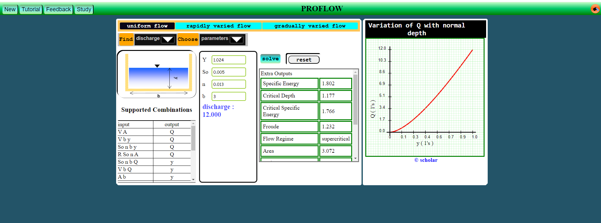

# ProFlow

This is a hydraulics project powered by javascript, html and css. The developed
application computes flow characteristics of rectangular, triangular and
trapezoidal sections under uniform, rapidly varied and gradually varied
flow conditions. This project was developed as an approach to an undergraduate hydraulics assignment in civil engineering.

## How to Download the APP

- Click on the button labeled **code** (usually green).
- On the menu that appears, click **Download ZIP**.
- Move to your downloads folder, and unarchive the zipped file.
- Note that this app has been developed for use on computer, not mobile devices.

### Content of the Unarchived Folder

The file contains

- Library folder (This is where source code resides).
- app.html file (This is the start point of the program).
- readme pdf (contains instruction on how to use the app).
- README.md file.
- Begin by reading the readme pdf file.
- To run the application, double click on the app.html file.
- Note that you don't need internet connection to run the application.

## Modifying the APP

The source code is free for you to modify and use in your own projects.

## Contributing to the ProFlow Projects

Any contributions to better ProFlow are welcome via pull request.
